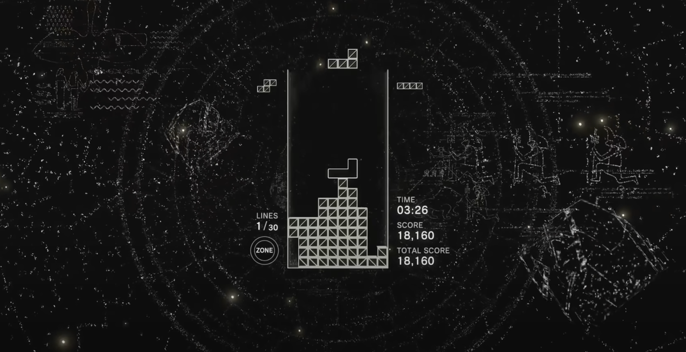
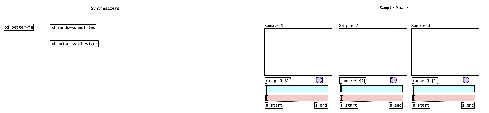
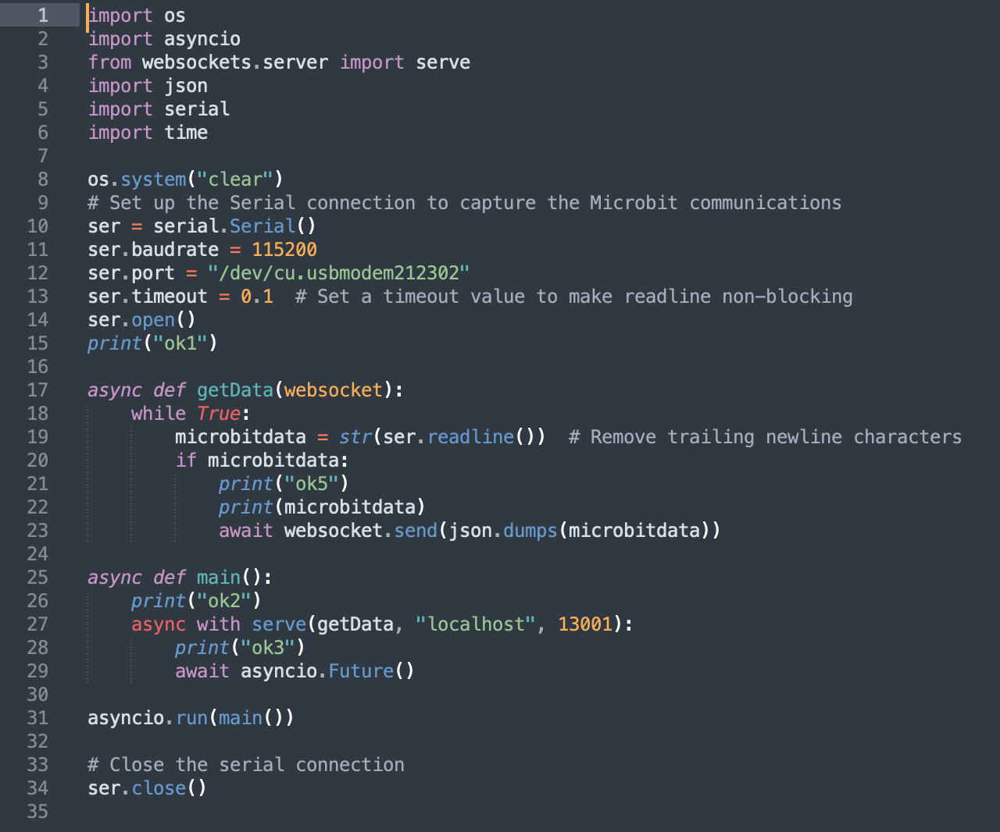

- **Title**: Tetris Illuminated: A Journey from Darkness
- **Composer**: Kevin Zhu

# Description
## Intro/Overview
Overall, this performance is a blend of music, visuals, and gameplay. It features adaptive music similar to Tetris: Effect, where the music dynamically changes based on gameplay events. As the player progresses and achieves higher scores or reaches certain milestones, the tempo can be modified, new layers of instrumentation can be added, or more complex musical patterns can be introduced by members at the backend.

The performance also utilizes generative music capabilities of Gibber and Puredata to create evolving melodies, harmonies, and rhythms, drums, samples, etc. The music generation is linked to game events, such as clearing lines or achieving combos, to generate unique musical sequences in real-time. Members in the backend will be live coding and playing preset sequences based on the game situation.

In terms of visuals, the performance creates visual elements that synchronize with the music. Graphics or animations react to different sound parameters using P5.js and Hydra, enhancing the overall experience and creating a more immersive performance.

The performance also includes a WebSocket for control, various sound setups, and a Tetris-like gameplay with a twist. The gameplay involves a variety of shapes and colors, and the game's state can be controlled through the Microbit.

Overall, the performance has a fixed framework, but because it is completely dependent on the game itself, the performance will be accompanied by uncertainty. Therefore, group members need to be prepared to judge unexpected events at any time and use pre-written code or improvise to perform live coding.

## Performance Structure
The structure of the performance can be broken down into the following stages:

**Stage 0** - *"0"*: Before the performance begins, all members need to have all the parameters that need to be preset in their files ready. Each member has a specific role and equipment setup.

**Stage 1** - *Dark Chaos*: The performance starts off very quiet, with only the sound of the game itself.

**Stage 2** - *A Beam of Light in The Darkness*: When the first line in the game is eliminated, the Bass and drumbeat will gradually be introduced, combined with the background slowly fading in.

**Stage 3** - *Dawn*: As the game progresses to the second and third levels, the sound will gradually amplify and increase. A new theme will be introduced, and the overall brightness will increase. The theme becomes brighter, the sound layers increase, and the speed becomes faster.

**Stage N** - *Colourful World*: Every one level, the theme will switch to different kinds of emotions and colours. There will be a template and the group members can start improvising, making their own changes to the arranged parts that can be modified.

**Stage N+1** - *"1"*: After more than 5 minutes, the player can slowly stack the Blocks higher and approach failure, and finally choose to end the game. With the sound of the game ending, the performance ends.

### Feelings Behind
The performance structure is a poignant metaphor for the experience of a blind person who momentarily perceives a glimmer of light, only to be plunged back into darkness. Stage 0, "0", represents the initial state of blindness, a world devoid of light and color. As we move into Stage 1, Dark Chaos, the performance begins in silence, mirroring the quiet solitude of the blind experience. Stage 2, A Beam of Light in The Darkness, symbolizes the sudden, unexpected perception of light, a brief respite from the darkness, akin to the first line in the game being eliminated. The journey continues to Stage 3, Dawn, where the sound amplifies and the theme brightens, reflecting the temporary exhilaration and sensory overload of this newfound 'vision'. Stage N, Colourful World, represents the fleeting moment of sight, filled with vibrant colors and emotions. However, the reality of blindness returns in Stage N+1, "1", where the game ends, symbolizing the painful realization that the light was transient and the darkness remains. I hope that this performance is a powerful exploration of the transient nature of perceived light in the perpetual darkness of blindness.

# Files and Resources
## Hardware
- One Micro:bit --- To control the game

- 4 Laptops with internet --- To use Gabber
## Software
- Gibber --- Where the music and visualization comes out
- Puredata --- Where the music comes out
- websocket.py (Use **ls /dev/cu.*** to check which serial port is connected, and run **python websocket.py** in the terminal inside the directory.) --- To connect Gibber with Micro:bit

- Member1-Visualization (Copy-Paste to Gabber)
- Member2-Drum, Kick, Clave, Hat (Copy-Paste to Gabber)
- Member3-Lead, Chord, Bass (Copy-Paste to Gabber)
- Member4 (A folder which includes all the samples and synthesizers)
- Member4-Sample, Synthesizer.pd
- aeolian.pd
- fmsynth.pd
- pan.pd
- variable-lfo.pd

# Usage
## Recreation
To recreate this performance, a total of five members are needed. Three members will join the same Gabber: one will be responsible for live coding and improvising visualizations, one will handle instruments such as the Drum and Clave, and one will handle Synthesizers related to Notes such as Lead and Chord. Another member will be in charge of playing the game using Microbit, and the last one will operate pre-self-composed Synthesizers and Samples in the Backend using Puredata. Except for the member playing the game, everyone needs to have a different computer, with only the visualization member and the Puredata member needing to output sound. The only screen displaying should be the visualization member with the Gabber full screen opened.

## Caveats
Before the performance begins, everyone needs to run the presets in their files to be ready. After the performance begins, everyone follows the pre-set script, which starts off very quiet, with only the sound of the game itself. When the first line is eliminated, the Bass and drumbeat will gradually be introduced, combined with the background slowly fading in. When the second level is reached, the sound will gradually amplify and increase. When the third level is reached, a new theme will be introduced, and the overall brightness will increase. In this way, as the levels progress, the theme becomes brighter, the sound layers increase, and the speed becomes faster. Once the sound layers increase, the group members can start live coding, making their own changes to the arranged parts that can be modified. Finally, after more than 5 minutes, the player can slowly stack the Blocks higher and approach failure, and finally choose to end the game. With the sound of the game ending, the performance ends.

It's worth noting that if the Blocks are accidentally stacked high during the performance, the group members also need to make the music more urgent, and if the game ends, the player can click to continue the game.

# References
1. ΔNDR0M3DΔ. Unknown. (CC BY-NC-SA 4.0). Retrieved from: https://hydra.ojack.xyz/?sketch_id=OH0LaTojSWiUI3p4

2. DUNKNOWNUSER. Unknown. (CC BY-NC-SA 4.0). Retrieved from: https://hydra.ojack.xyz/?sketch_id=fdijCm5ZnGBBke84

3. Unknown. Unknown. (CC BY-NC-SA 4.0). Retrieved from: https://hydra.ojack.xyz/?sketch_id=Fu6rTGoF1LiYN1zG

4. Unknown. Unknown. (CC BY-NC-SA 4.0). Retrieved from: https://hydra.ojack.xyz/?sketch_id=oqDjX6wQwShv9ssl

5. MDN @markdenardo. Unknown. (CC BY-NC-SA 4.0). Retrieved from: https://hydra.ojack.xyz/?sketch_id=dfUc5QbNBtMXNVLL

6. Rangga Purnama Aji. Monochrome Memoar. (CC BY-NC-SA 4.0). Retrieved from: https://hydra.ojack.xyz/?sketch_id=rangga_2

7. Abhinay Khoparzi. Really Love. (CC BY-NC-SA 4.0). Retrieved from: https://hydra.ojack.xyz/?sketch_id=khoparzi_2

8. eerie_ear. Unknown. (CC BY-NC-SA 4.0). Retrieved from: https://hydra.ojack.xyz/?sketch_id=eerie_ear_1

9. Nelson Vera. Unknown. (CC BY-NC-SA 4.0). Retrieved from: https://hydra.ojack.xyz/?sketch_id=example_4

10. Olivia Jack. Unknown. (CC BY-NC-SA 4.0). Retrieved from: https://hydra.ojack.xyz/?sketch_id=example_3

11. Learn from the example resources given by Charles. Retrieved from: https://github.com/cpmpercussion/ComputerMusicIntro

12. Nick Robinson (Youtube User). 2019. 10 Minutes of TETRIS EFFECT Music and Gameplay. Inspired by this video. Retrieved from: https://www.youtube.com/watch?v=urbLIyd-VsQ

13. Easy websify (Youtube User). 2019. How to Make a Tetris game using p5.js - Step by step | JS Game EP-2. Learn through this video. Retrieved from: https://www.youtube.com/watch?v=wlZRCH3yMl8&t=5s

14. Pauric O'Donnell (Youtube User). 2019. 02 Microbit talks to PC via Serial and Python. Learn through this video. Retrieved from: https://www.youtube.com/watch?v=wlZRCH3yMl8&t=5s

15. Pauric O'Donnell (Youtube User). 2019. 02 Microbit talks to PC via Serial and Python. Learn through this video. Retrieved from: https://www.youtube.com/watch?v=fzMVV7ZMyvE

16. 0n-satrn (Patchstorage User). 2023. Gritty Sound Generator. Implemented this code. Retrieved from: https://patchstorage.com/gritty-sound-generator/

17. Microbit editor. Retrieved from: https://makecode.microbit.org/#editor

18. Hydra library. Retrieved from: https://hydra.ojack.xyz/api/

19. P5.JS library. Retrieved from: https://p5js.org/

20. Taras Chernus. 2018. person covering his eyes wallpaper. Unsplash License. Retrieved from: https://unsplash.com/photos/rWkpNxqE_rM

