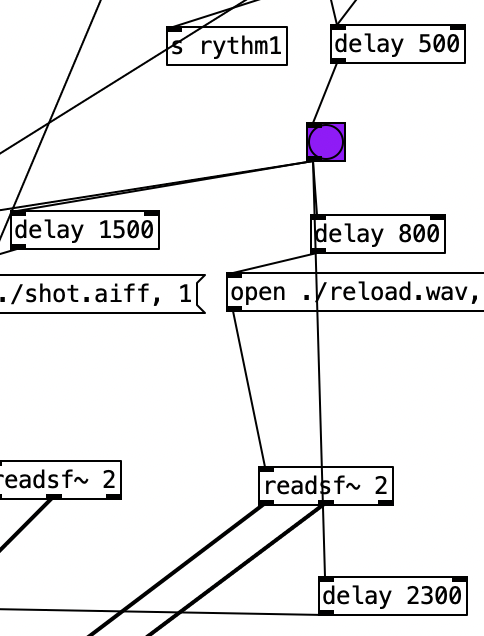
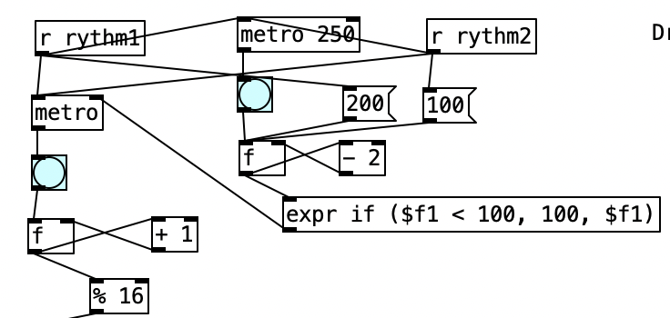
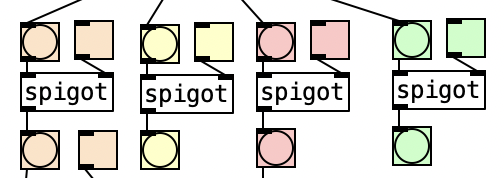
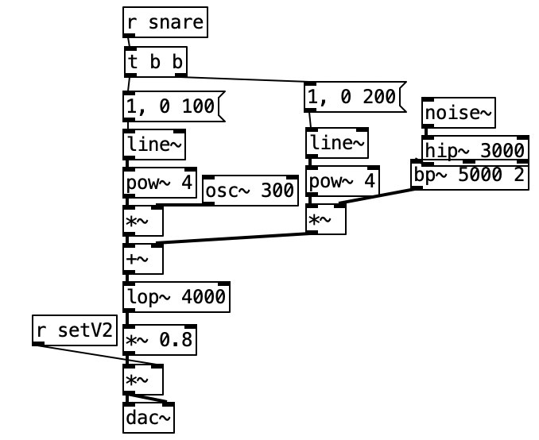
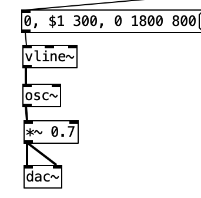
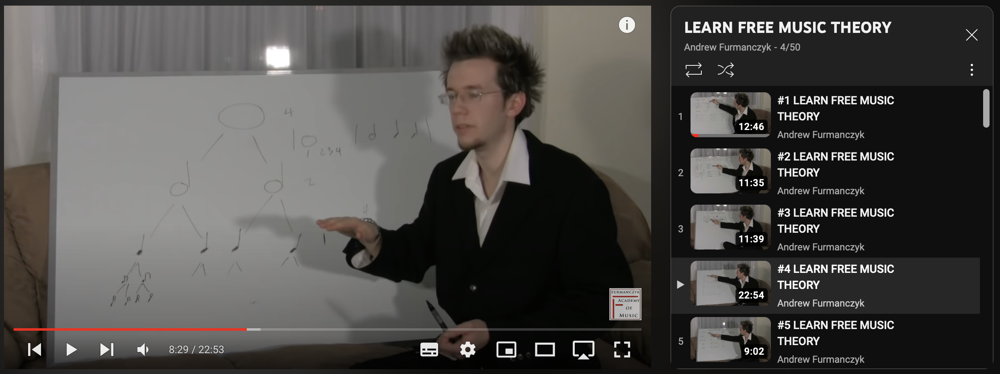

# Portfolio 1 Discussion

## Intro
In the past four weeks I have been learning new things by constantly making mistakes and learning through it. I find problems, learn about them, apply my knowledge, solve them, and finally leave new problems unsolved. Looking back on the past four weeks, it has taken me from being a novice who forgot to connect the right channel of the dac~ as a first diary to now being able to work with the group to create pieces.

## Review Problems
### Diary 1

**| *Trigger different bangs with only a bit delay.***

Delay can be achieved by playing one after the other, using a bang as a master control switch.

**| *Use While or some other methods to change frequency when playing.***

You can use the f function to increase or decrease, and then use the if expression to control the upper or lower limit. This is what I used in diary 2.

### Diary 2

**| *Swap between different channels.***

Spigot works perfectly for what I want to achieve. Whenever you want to switch between channels, you simply flip the corresponding spigot switch and connect to another channel to set it to off. This is also the case in Diary 3.

**| *Simulate drum sound.***

I learned to use phasor~, hip~, bp~, etc. to simulate noise~ as a  drum sound, which we used as a group in Diary 4.

**| *Implement vline~.***

This is exactly what we will be learning in the following week and is successfully demonstrated in diary 3.

### Diary 3

**| *The need for music understanding.***

I have now started to learn about music and the basics of what it takes to create music. I hope to be able to use this in my solo performance.

### Diary 4

**| *Install and learn Gem.***

I haven't managed to successfully install Gem yet but I'm still trying and have found other alternatives. These include p5.js in Processing.

**| *Learn music for better teamwork.***

I plan to learn how to create music in a team after learning the basics of music.

## Discussion
As well as searching the internet for relevant puredata material, including but not limited to watching tutorials on youtube, and understanding the piece of fellow workshop classmates, I also learn about music through video tutorials. All this has enriched my knowledge.

**As a group**, group performance and my performance as a member, as well as my performance in each workshop, do not made me satisfied. As I continued to work together, I gradually realised it is important that one person to link the whole group together, one person to be bold enough to put forward his or her own ideas and directions so that the other members would think. A newly formed group is like a loose ball of sand, so learning how to hold it together is the first step, followed by thinking about how to shape it. In the previous workshop jam I didn't think much about it, we simply combined each other's diaries and ended up playing without choreography which always made me think that there were more possibilities and that we could do better. So, in Diary 4 I was bold enough to come up with my own ideas on how to arrange and work together. Although I wasn't very happy with the result, as we had a scheduling conflict and didn't get to do more meetings, I felt I was on the right track.

**As an individual**, I am constantly thinking about how I can improve, what is the thing I am missing to construct a better performance. Firstly, I need to be creative, I can't just use PD to sample others' pieces like in diary 1, but I need to create my own piece. To do this I need to experiment as much as I did with diary 3, I need to explore different musical territories and bring it to life with powerful computer music. Secondly, I should improve my skills in puredata, there is still a lot more functions and objects that I do not know. Learning from other students' pieces is a good idea.

## References
1. Andrew Furmanczyk (Youtube user). 2010. LEARN FREE MUSIC THEORY. Currently learning from this tutorial. Retrieved from: https://www.youtube.com/watch?v=6gHEIF0rT2w&list=PLB585CE43B02669C3&index=1

2. Kreidler, J. 2013. Programming Electronic Music in Pd. Learn Puredata from this e-book.

3. QCGInteractiveMusic (Youtube user). Puredata tutorials since 2021. Learn many concepts from his tutorials. Retrieved from: https://www.youtube.com/@QCGInteractiveMusic

4. Learn from the example resources given by Charles. Retrieved from: https://github.com/cpmpercussion/ComputerMusicIntro

5. SMC2023. 2023. Get inspired by all the classmates, viewed almost everyone's video each week. Retrieved from: https://anu365.sharepoint.com/sites/SMC2023