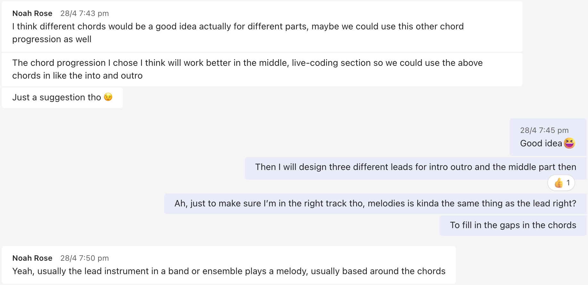
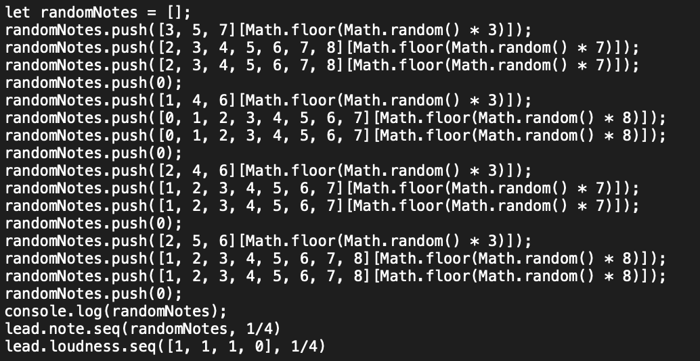

# Portfolio 2 Discussion

## Intro
In the past four weeks, with the help of my teammates, teachers, and friends, I have made continuous progress in my understanding of music and computer music. While challenging myself with the fresh Gibber, I also consolidated my knowledge of Puredata and revisited p5js and various plugins that I had learned before. Overall, this four-week learning journey has been extremely beneficial to me.

## Discussion
**As a group**, I have learned more about collaborating with others to create music. It's important not to impose your own ideas on everyone, but to take in everyone's suggestions. In Week 9's group diary, we got to know each other's strengths and weaknesses through multiple meetings and helped each other progress. For example, Wangshu had no knowledge of music but was familiar with coding, while Noah was a music major but the opposite. We have treated each other respectfully and in the end, each of us had a more comprehensive understanding of music and coding. For example in week 9 and week 10, we ask for each others oppinions and give suggestions.
In addition, collaborating with different people during workshops has helped me improve. Expressing my own ideas, listening to others' suggestions, and working together to create unknown works through live coding.

**As an individual**, I have tried many extracurricular activities, such as connecting Microbit, learning and using p5js, Processing, and Gem. Every time I see my classmates mastering knowledge that I don't know in class, I will ask them for their patches, hoping that I can use them next time. Whenever I get stuck, I ask my teammates on Teams, and they patiently help me solve the problem. 
Like in the week 6, it showcases the ability to adapt existing code to create a new interface. I experimented with different tools and techniques to connect the Microbit and create Gem animations. I tried to highlight the original author's technical skills, especially in working with different technologies. I appreciate the chance to learn from others patches, which allows me to absorb knowledges from others.
It's clear that my learning journey has been a gradual process. The UI exploration I did in solo performance has been carried over to Puredata later on, while the music production skills I learned in Gibber as part of a group will definitely be used in my final performance.

### Important Lessons
The importance of collaboration: Collaboration is crucial in music computing, as it involves a wide range of skills and knowledge. By working with others, I learnt from their strengths and weaknesses, and create more complex and interesting projects.

The power of experimentation: Experimentation is a critical aspect of music computing, as it allows me to try out different ideas and see what works best. In week 9, I have tried the possibility to make a random lead base on the chord progressing.

The importance of learning multiple tools: Music computing involves a wide range of software and hardware tools, and learning to use them can greatly expand my creative possibilities. For example, in week 8, I tried to use microbit all by own before the lecture teaches.

### Common threads
A focus on sound design: Many diaries discuss the importance of sound design in music computing, and how it can be used to create unique and interesting compositions.

A focus on experimentation and exploration: Many diaries also emphasize the importance of experimentation and exploration in music computing, and how it can lead to new and exciting ideas.

A focus on collaboration and community: Finally, many diaries highlight the importance of collaboration and community in music computing, and how working with others can help you learn and grow as a musician and a person.

## Conclusion
In conclusion, my journey in music computing has been a valuable experience that has taught me many important lessons. Through collaboration, experimentation, and learning multiple tools, I have gained a more comprehensive understanding of music and computer music. As I continue to explore this field, I will keep these important lessons in mind and continue to focus on sound design, experimentation, and collaboration with the community.

I am grateful to my teammates, teachers, and friends for their support and guidance throughout this journey. I look forward to applying what I have learned in my future projects and performances such as the upcoming LENS.

## References
1. Learn from the example resources given by Charles. Retrieved from: https://github.com/cpmpercussion/ComputerMusicIntro

2. SMC2023. 2023. Get inspired by all the classmates, viewed almost everyone's video each week. Retrieved from: https://anu365.sharepoint.com/sites/SMC2023