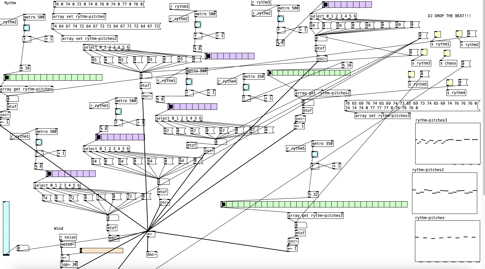

# Week 2 reflection

## Why this piece?
*Requirement: two perceptually distinct waveforms/sounds.*

To meet the requirement, I spent a week merging ideas, starting with a vision to blend a race countdown with the sound of race cars to create a symphonic story. Later, I considered an alien conversation followed by a gunfight, inspired by Yoasobi's storytelling approach. I started learning more advanced skills about Puredata. However, I realized creating a one-minute piece was impossible through the process of learning, and my lack of music theory knowledge hindered my ability to compose a high-quality, catchy tune. Despite attempting to use a While Loop for composition, I abandoned the idea and instead focused on sampling the climax of "Lu Xiao Yu," a piano piece I adore.

## How?
Using Midi and trial and error, I recreated the climax by hand. 

I utilized Array, Select, and Metro to write different parts of the climax so that I could play them separately and wished that there is a method that I could automize it. However, I still couldn't find a method to simplify the process of manipulating different parts until I submitted this work.
 

### **Problems unsolved**
- Trigger different bangs with only a bit delay.
- Use While or some other methods to change frequency when playing.

## References
1. Kreidler, J. 2013. Programming Electronic Music in Pd. Learn Puredata from this e-book.

2. Jay Chou. 2020. 路小雨. Inspired by this piano piece. Retrieved from: https://www.youtube.com/watch?v=fOEeDDyMyws

3. Tobias Hartmann (Youtube user). 2019. 06 Pure Data Tutorial - Bang and Trigger. Learn from this tutorial. Retrieved from: https://www.youtube.com/watch?v=p42GqoTmaUg&t=396s

4. Tobias Hartmann (Youtube user). 2019. 12 Pure Data Tutorial - if Expression. Learn from this tutorial. Retrieved from: https://www.youtube.com/watch?v=oLsL6rLRGGM

5. ShankarBaba (PdPatch forum user). 2009. Noise code inspired by a reply. Retrieved from: https://forum.pdpatchrepo.info/topic/2218/noise-osc
