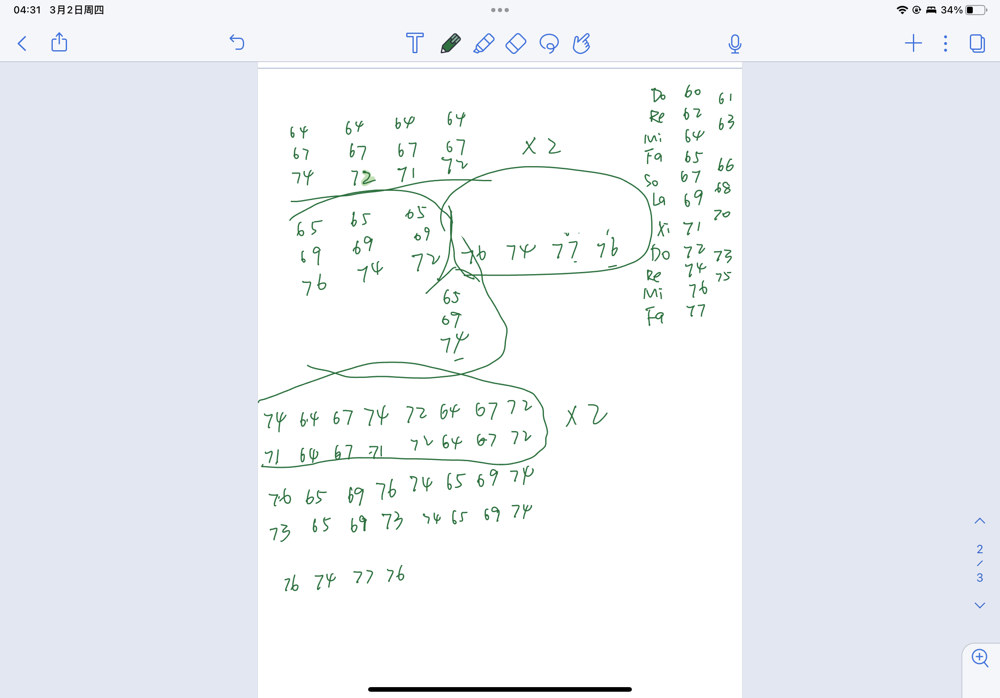

# Week 2 reflection

As a Pure Data beginner, I was instantly captivated by its potential. I spent a week merging ideas, starting with a vision to blend a race countdown with the sound of race cars to create a symphonic story. Later, I considered an alien conversation followed by a gunfight, inspired by Yoasobi's storytelling approach. However, I realized creating a one-minute piece was impossible, and my lack of music theory knowledge hindered my ability to compose a high-quality, catchy tune. Despite attempting to use a While Loop for composition, I abandoned the idea and instead focused on recreating the climax of "Lu Xiao Yu," a piano piece I adore. 

Using Midi and trial and error, I recreated the climax by hand. 

I utilized Array, Select, and Metro to write different parts of the climax so that I could play them separately and wished that there is a method that I could automize it. However, I still couldn't find a method to simplify the process of manipulating different parts until I submitted this work. I tried using Trigger, but the gap was too short.
 

## References
- comment: E-book of the pure data tutorial
    - url: https://editor.p5js.org/codingtrain/sketches/H7Wh2m_ja

- comment: Inspired by this piano piece 
    - url: https://www.youtube.com/watch?v=fOEeDDyMyws

- comment: Used a little bit code because I learn to use array from these videos
    - url: https://www.youtube.com/watch?v=p42GqoTmaUg&t=396s
    - url: https://www.youtube.com/watch?v=oLsL6rLRGGM

- comment: Noise code inspired by a reply
    - url: https://forum.pdpatchrepo.info/topic/2218/noise-osc
