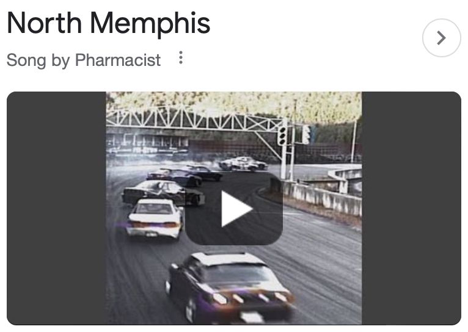
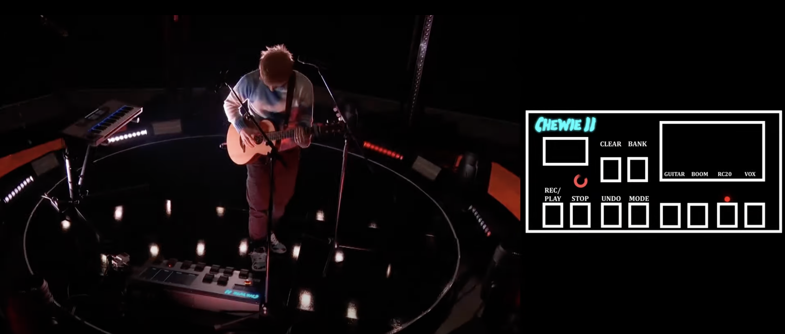
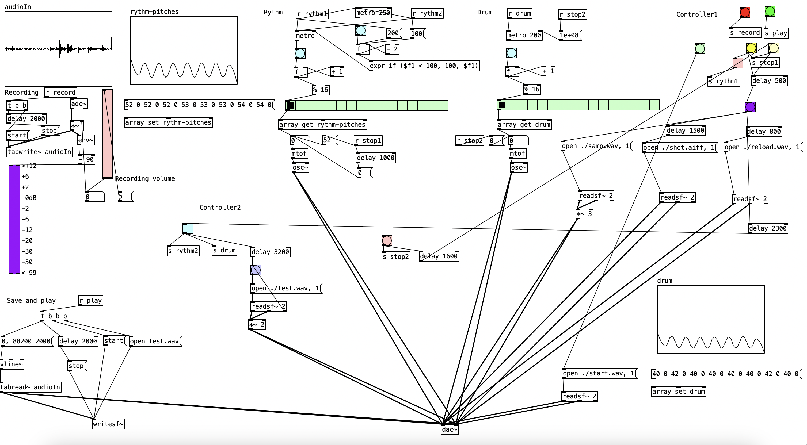

# Week 3 reflection

## Why this piece?
*Requirement: Create a piece using sampled sounds which say something about you.*

This week I focused on implementing multiple audio tracks, including audio that I sampled during the performance, and using delay to play them back accordingly. My inspiration for this piece came from "North Memphis" by Pharmacist, a fast-paced Phonk music track.

The theme reminded me of enjoying Ed Sheeran's live loop pedal performances, where he creates ensemble performances by recording various instruments and adding echo effects. It is like a band of 'himself'.

## How?
I started simulating what Ed Sheeran was doing, so I managed to learn how to record sounds manually in Puredata, and luckily there is a tutorial for that.

I got stuck on the problem I encountered in my previous diary, which was the constant acceleration of the metro, causing it to gradually speed up until it finally came to a stop. After some research, I discovered that I could use the "expr if" function to achieve this goal.

The biggest challenge I faced was not being able to simulate drum sounds and achieve the phonk effect as in "North Memphis". This makes the current piece monotonous. I should use vline~ to create envelopes.

I should also find a method to switch between different channels for recording the samples instead of changing them manually.

### **Problems unsolved**
- Swap between different channels.
- Simulate drum sound.
- Implement vline~.

## References
1. krzysiunet (Freesound user). 2016. I'm not speaking English (CC BY-NC 4.0). Retrieved from: https://freesound.org/people/krzysiunet/sounds/345836/

2. schots (Freesound user). 2017. Gun shot (CC BY-NC 4.0). Retrieved from: https://freesound.org/people/schots/sounds/382735/

3. EminYILDIRIM (Freesound user). 2020. Pistol Gun Cocking (CC BY-NC 4.0). Retrieved from: https://freesound.org/people/EminYILDIRIM/sounds/543927/

4. QCGInteractiveMusic (Youtube user). 2021. 42. Sampling with Pure Data. Learn from this tutorial. Retrieved from: https://www.youtube.com/watch?v=v2FQpF28M5E

5. Phamacist. 2020. North Memphis. Get inspired. Retrieved from: https://www.youtube.com/watch?v=nkQFuwvCoPo

6. Brody Oliver Bassett (Youtube user), Ed Sheeran. 2022. Shivers Loop Pedal Ed Sheeran View. Get inspired. Retrieved from: https://www.youtube.com/watch?v=KhH5qN7kWkg