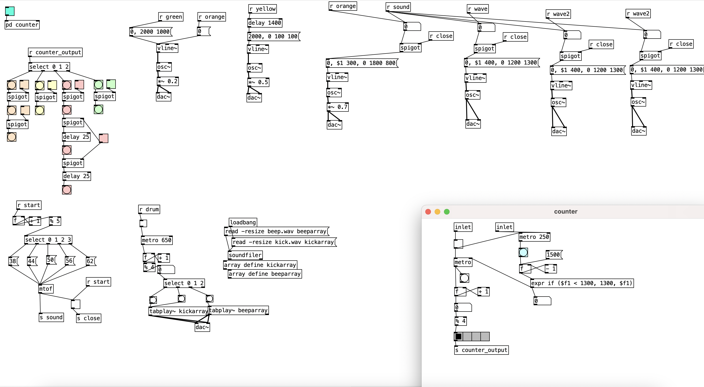

# Week 4 reflection

## Why this piece?
*Requirement: With a single sound source, create a piece using envelopes.*

For this week’s dairy, from my understanding I shouldn’t be doing a piece that is complicated. There should be only one sound source playing at a time.

The piece is inspired by jazz songs, and I admire the slow rhythm it has, so I would like to create one myself. I knew that this time it wouldn't be 'good' because it was the first time totally 'my piece' from scratch, including the composition.

## How?

After hanging my mind, I decided to slowly accelerate the metro and change the tone of the envelope in play. I use spigots as the main controller, turn on the switches to enrich the piece as it progresses. I originally planned to add more spigots to increase layers when performing. But due to the lack of music theory, I did not know what to add.

The small envelope of the first beat and the big envelop of the third beat in the piece form a contrast. I deliberately increased the release phase of the small envelope and reduced its volume, while the larger Envelope I played instantaneously with three osc~ with delays to simulate echo, and intentionally shortened the release phase and expanded the sustenance phase. The second and fourth beats are also related. If they are dropped together (fourth then second beat), a complete envelope can be obtained.

### **Problems unsolved**
- The need for music understanding.

## References
1. argarak (battle of the bits user). 2020. click-.point via rtsampler. Inspired by this. Retrieved from: https://battleofthebits.org/arena/Entry/click-.point+via+rtsampler/33762/#

2. Borrowed codes from the resources given by Charles. Retrieved from: https://github.com/cpmpercussion/ComputerMusicIntro