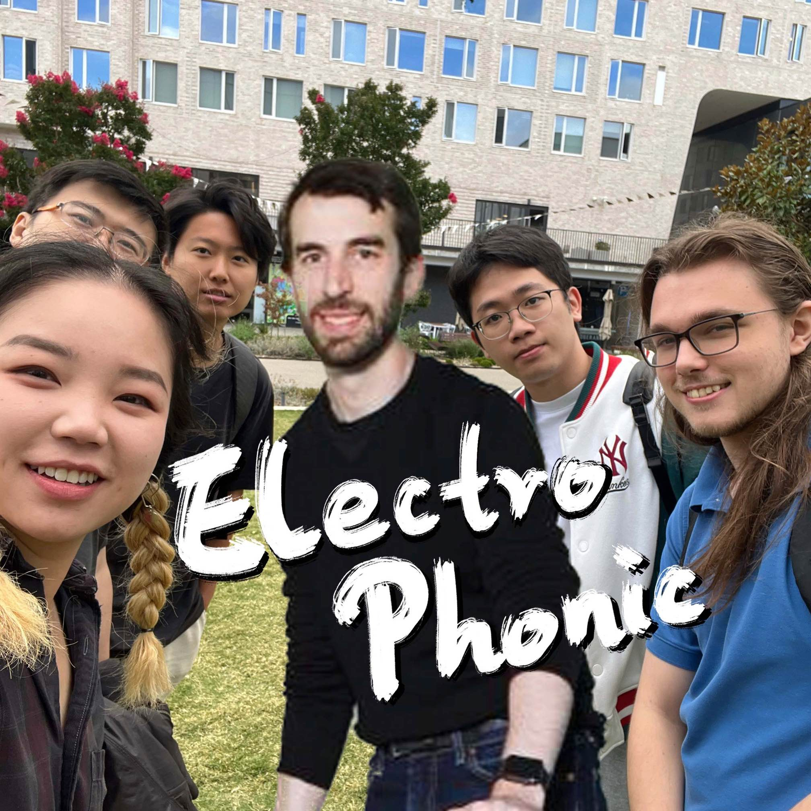
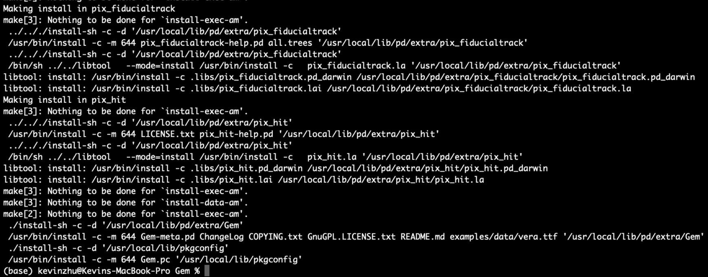
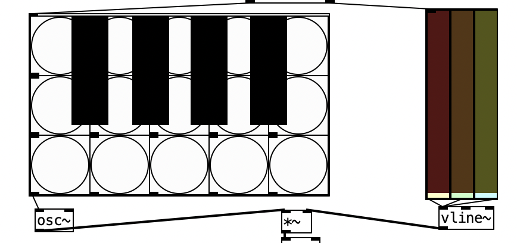
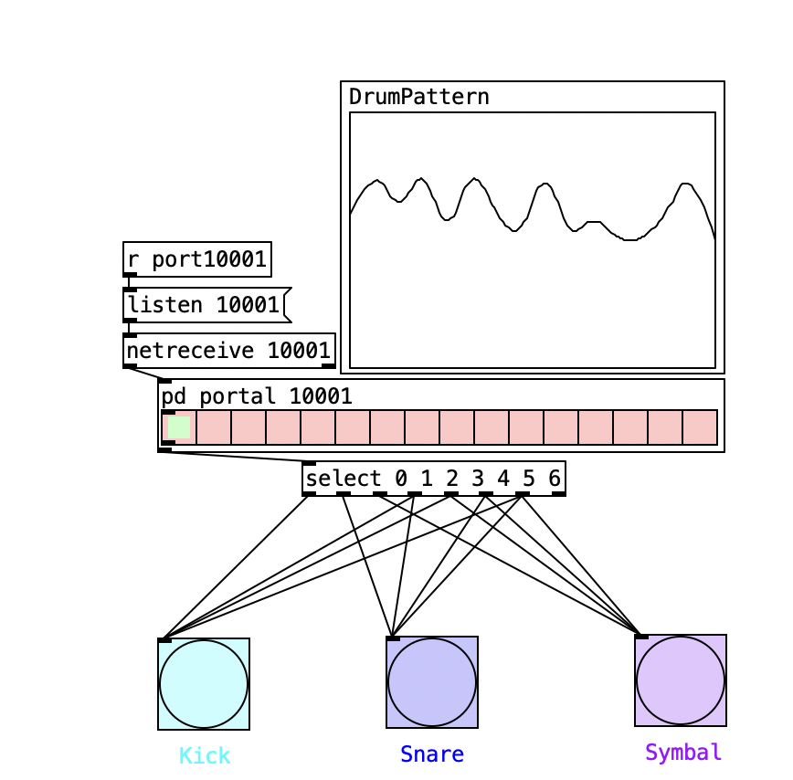
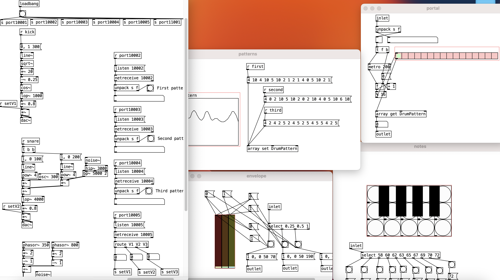

# Week 5 reflection

Regarding this week's group diary, although we didn't create a particularly impressive piece, we successfully used a network to connect the entire "band" together. As the conductor, I visualized everything and created an audio that could be adjusted in real-time. We had two meetings to discuss the network's feasibility and decided on each member playing one instrument.

However, I encountered a problem with the Gem extension, which generates real-time 3D graphics based on sound. Despite my efforts to find the source code, I couldn't install it due to Apple Silicon-related bugs.

I simulated a piano and drum and hide the complex codes that displayed parts of each instrument in real-time based on key length and pattern. There are many details and codes beyond the video.

Overall, this performance was very successful during the preparation stage. However, personally, I think if I could use Gem and arrange the performance order in advance, such as pausing or changing at a certain time point, we could be even more successful. In addition, I think I should add a part to the "master piece" that allows me to control the tuning and volume of their instruments, making the use of the network more useful.

## References
- comment: Inspired and borrowed code
    - url: https://www.youtube.com/watch?v=br7Hcx_FLoc

- comment: AI simulated voice
    - url: https://play.ht
    - personal, non-commercial use (https://play.ht/terms/)