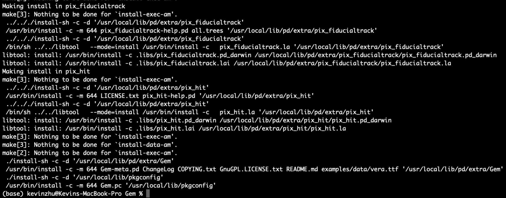
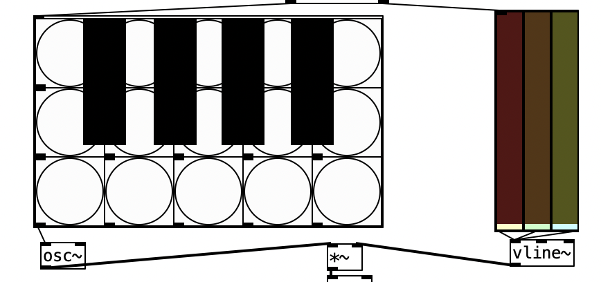
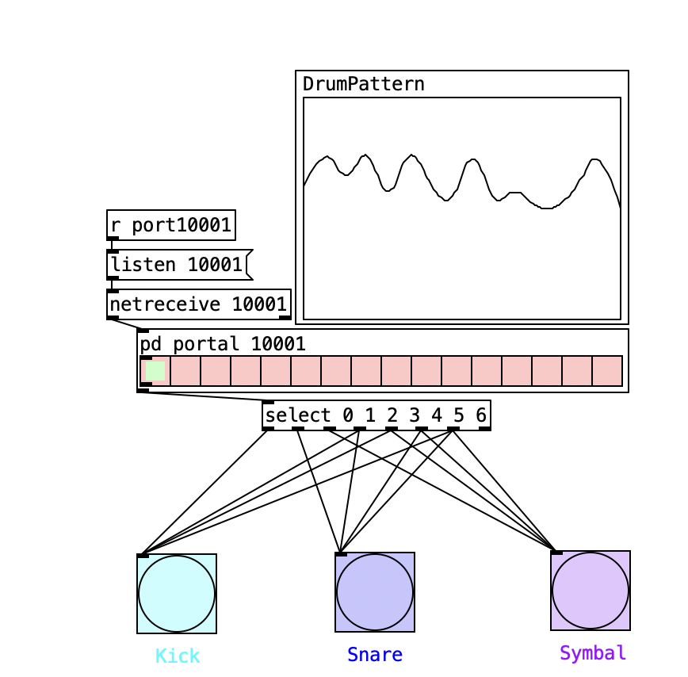
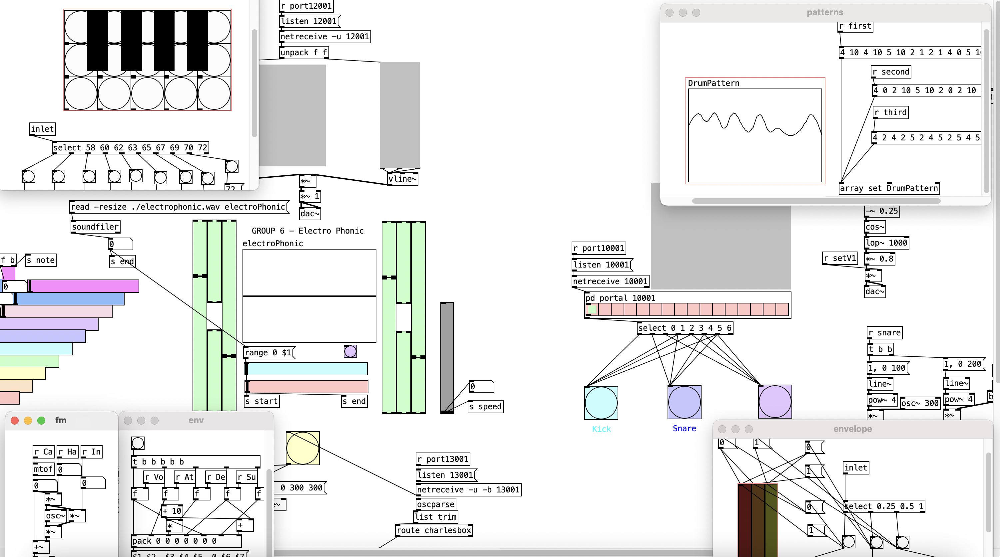

# Week 5 reflection

## Why this piece?
*Requirement: 3 mins piece as a group*

Regarding this week's group diary, although we didn't create a particularly impressive piece, we successfully used a network to connect the entire "band" together. 

## How? 

As the conductor, my mission was to visualized everything and created an sample in the middle that could be adjusted during the performance. We had two meetings to discuss the network's feasibility and decided on each member playing one instrument.

However, I encountered a problem with the Gem extension, which generates real-time 3D graphics based on sound. Despite my efforts to find the source code, I couldn't install it due to Apple Silicon-related bugs.

I simulated a piano and drum and hide the complex codes that displayed parts of each instrument in real-time based on key length and pattern. There are many details and codes beyond the video.

Overall, this performance was very successful during the preparation stage. However, personally, I think if I could use Gem and arrange the performance order in advance, such as pausing or changing at a certain time point, we could be even more successful. In addition, I think I should add a part to the "master piece" that allows me to control the tuning and volume of their instruments, making the network more useful.

### **Problems unsolved**
- Install and learn Gem
- Learn music for better teamwork

## References
1. QCGInteractiveMusic (Youtube user). 2021. 42. 39. Modifying Audio File Playback with Pure Data. Learn from this tutorial and borrowed some of its code. Retrieved from: https://www.youtube.com/watch?v=br7Hcx_FLoc

2. G12-week-5. 2023. diary-week-5. Get inspired. Retrieved from: https://anu365.sharepoint.com/sites/SMC2023/_layouts/15/stream.aspx?id=%2Fsites%2FSMC2023%2FShared%20Documents%2FGeneral%2Fdiary%2Dsubmissions%2Fdiary%2Dweek%2D05%2FG12%2Dweek%2D5%2Emp4&referrer=Teams%2ETEAMS%2DELECTRON&referrerScenario=teamsSdk%2DopenFilePreview

3. AI simulated voice (personal, non-commercial use). 2023. Retrieved from: https://play.ht