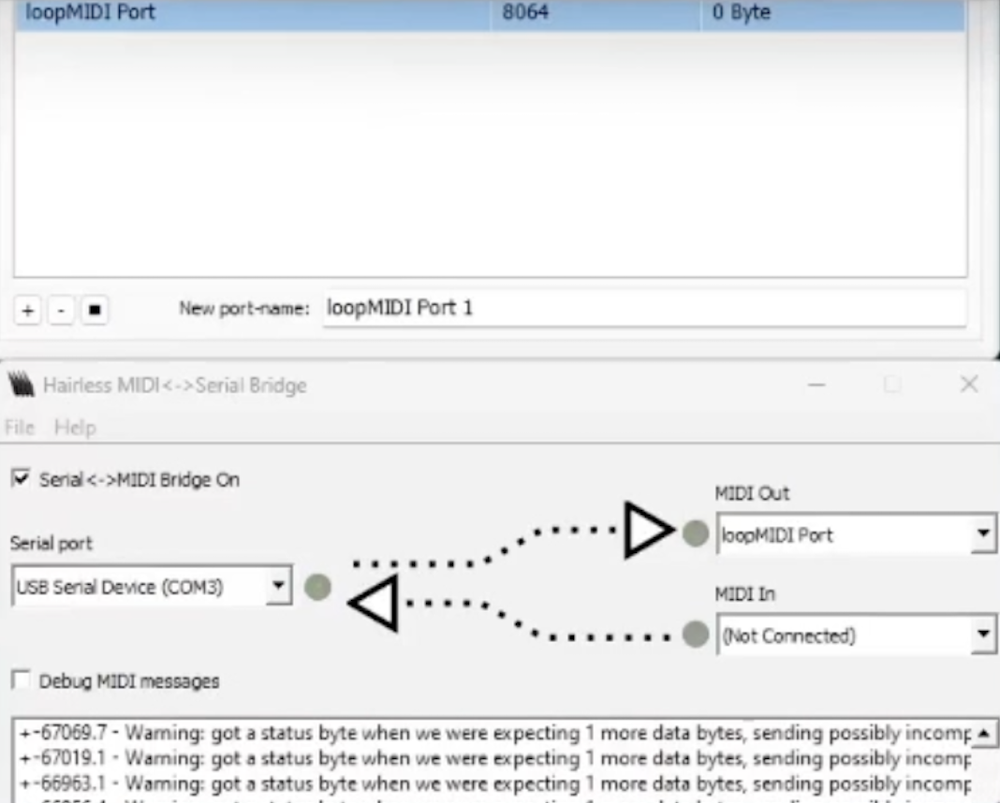
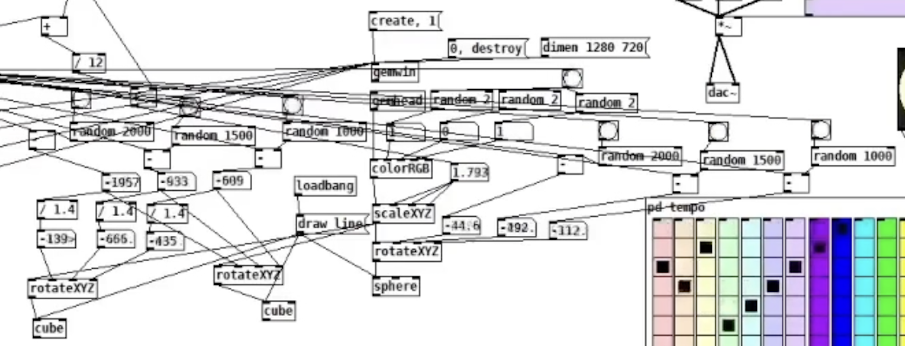
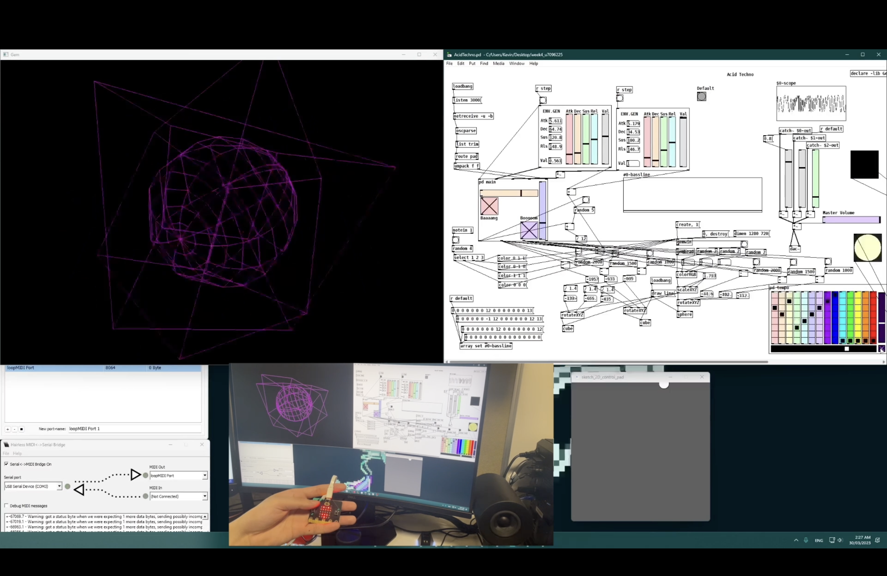

# Week 6 reflection

This week's theme led me to adapt a piece from a fellow classmate and add a new interface. I chose this piece purely because I thought the original author did a great job and I wanted to understand their code while adapting it. My idea was to use Gem and Processing, along with some built-in Pd GUI elements, to complete the visualization and interface. I would use Processing for part of the interface operations, and then use PdParty on an iPad to operate some sliders and either a Microbit or Microsoft controller to operate the remaining buttons to change the state of the piece. However, due to technical limitations, I was unable to download the iOS version of PdParty, so I unfortunately had to omit that part and move it to the interface operations in Processing. I spent a lot of time figuring out how to connect the Microbit and creating Gem animations.
Connecting the Microbit required several apps as bridges, and I had to go to the Microbit website to set up the button functions to transmit a signal. 

The Gem animations required many parameters, so I decided to use various randomizations to react to each beat of the music. 

Finally, one of the biggest challenges was understanding the original author's code. After asking the author and understanding their intentions, I finally grasped the overall logic of the patch and come up with this piece.

## References
1. Unkown. 2020. How do I play a MIDI instrument on the micro:bit. https://support.microbit.org/support/solutions/articles 19000053392-how-do-i-play-a-midi-instrument-on-the-micro-bit

2. Fergo. 2004 - 2019. Fergo JoystickMIDI. Used this to connect the controller. https://www.fergonez.net/softwares/fjoymidi

3. Nikola Nikita Jeremic (Youtube user). 2020. How to connect your game controller as a MIDI device in Studio One. Retrieved from: https://www.youtube.com/watch?v=UCT6-CzRAZk

4. Sound Simulator (Youtube user). 2022. How to Create Live Visuals in Pure Data!. Learn from this tutorial. Retrieved from: https://www.youtube.com/watch?v=y1rBa_STq64&t=278s