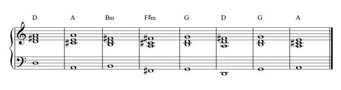
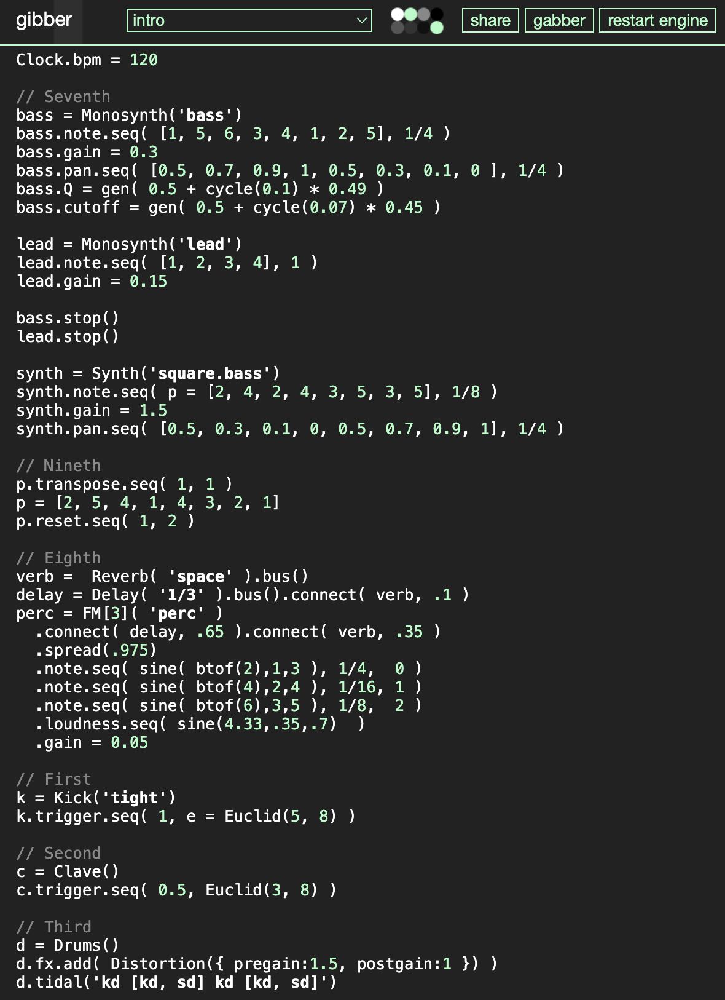
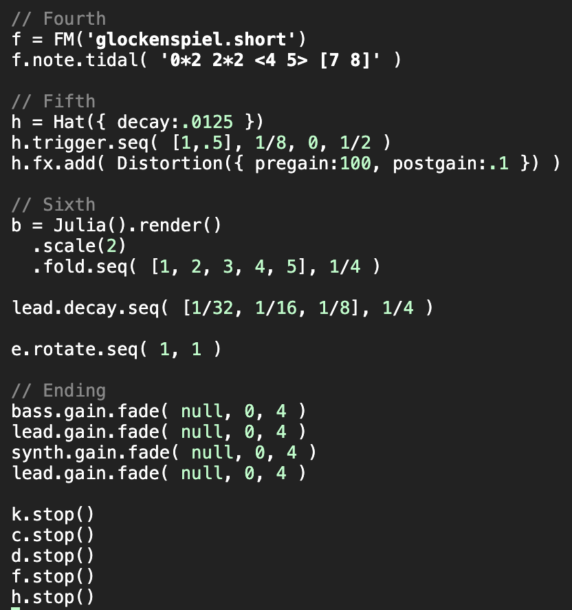

# Week 8 reflection

In this reflection, I would like to discuss my experience in composing and arranging music using Charles and Gibber's built-in tutorials and demos. I experimented with a variety of instruments and explored the convenience that Gibber offers along with my familiarity with coding. For my lead, I chose to base my composition on the chords of a canon, and for my bass, I used a simple melody to accompany the lead. To add rhythm and beat, I incorporated not only drums but also other instruments like Clave, kick, and hat. These additions helped to enhance the percussion and pulse of the piece.

The most challenging part of this project was working with the different instruments and combining them to create a cohesive composition. I spent a lot of time experimenting with the various instruments and understanding how they worked together. I have made a helpful discussion with the teammates on workshop, so I begin with the piece I have made on the workshop with my teammates.

## References
1. charlie roberts. 2022. gibber 2: intro tutorial. Learn through this video. Retrieved from: https://vimeo.com/728710492

2. charles martin. 2021. Laptop Music Coding with Gibber. Learn through this tutorial. Retrieved from: https://charlesmartin.au/blog/2021/01/10/laptop-music-workshop