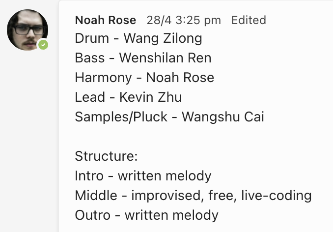
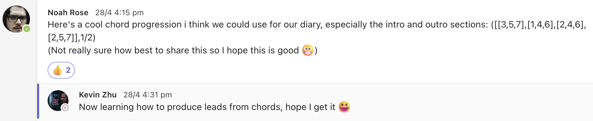
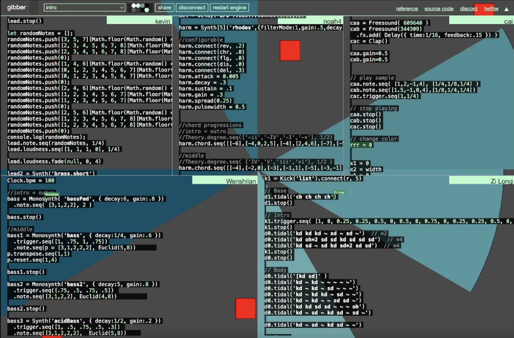

# Week 9 reflection

In this group diary project, we had multiple meetings and discussions to create our musical performance. During our first two meetings, we discussed our creative direction and allocated roles for each member to play. Our musician, Noah, composed the chord progressions for our piece, and I was responsible for playing the lead and some of the clave, kick, and hat. To learn how to write a lead that could accompany the chord progressions, I spent a lot of time researching online tutorials and created two leads for our performance. One lead had four fixed patterns, while the other used functions that could generate random notes based on the chord progressions. I also developed various ad hoc functions, such as range, rotate, and transpose, to enhance the second lead.

As we progressed, we tried out Gibber in our meetings and fine-tuned our coordination. We even managed to crash seven rooms in the process! Finally, we scheduled a meeting to plan the performance's order and worked on it in five recording sessions in a library room.

Overall, this project was a great learning experience in collaborating with others and developing our musical skills. We faced many challenges along the way, but we overcame them with determination and teamwork. I enjoyed working with my group members and look forward to collaborate with them again in the final LENS.

## References
1. r/guitarlessons forum. 2020. How to create leads from chords?. Retrieved from: https://www.reddit.com/r/guitarlessons/comments/gzh1cp/how_to_create_leads_from_chords/