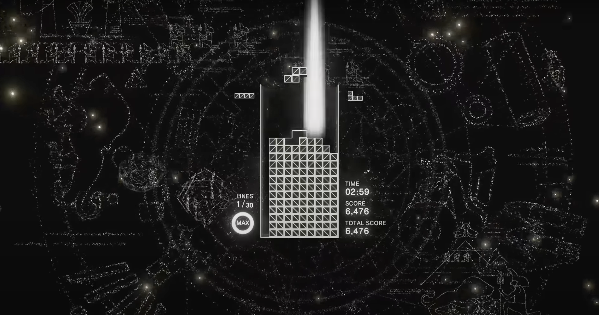

# Week 10 reflection

For my final project, I decided to create a game that I really enjoy playing called Tetris. I focused on creating sound effects for the game, as the visualization and game mechanics of Tetris are relatively simple. The movement, elimination, and rotation of the blocks can all interact with the sound effects, creating a unique audio-visual experience. I planned to use the changing patterns of the Lead and chords to guide the game into different musical themes, with the game's background colour and particle effects adapting to the music. The result may be like a Tetris-based game called Tetris: Effect.

During the workshop and team meetings, I discussed and decided on each person's role and collaboration in detail. However, many parts of the project are still unfinished. The biggest challenge for me has been synchronizing the visuals and music while allowing for player interaction with the visuals.

In addition, I have left a lot of flexibility in every part of the performance for each member. Everyone can play in their style and code lively to change the piece but should all fit the theme planned.

## References
1. Nick Robinson (Youtube user). 2019. 10 Minutes of TETRIS EFFECT Music and Gameplay. Inspired by this game. Retrieved from: https://www.youtube.com/watch?v=urbLIyd-VsQ&t=412s

2. Easy websify (Youtube user). 2023. How to Make a Tetris game using p5.js - Step by step | JS Game EP-2. Learn through this tutorial. Retrieved from: https://www.youtube.com/watch?v=wlZRCH3yMl8&t=1s

3. SolidCode (Youtube user). 2019. Programming a Tetris Game with JavaScript and P5.js (Part I - Gravity). Learn through this tutorial. Retrieved from: https://www.youtube.com/watch?v=Wcb0_Q9r6i4&list=PLU1XJPGbHaCWP10fTxVtgIUsw7XP0uVbc

4. SolidCode (Youtube user). 2019. Programming a Tetris Game with JavaScript and P5.js (Part I - Gravity). Learn through this tutorial. Retrieved from: https://www.youtube.com/watch?v=Wcb0_Q9r6i4&list=PLU1XJPGbHaCWP10fTxVtgIUsw7XP0uVbc

5. nnxa (Github user). 2019. tetris. Learn from this code. Retrieved from: https://github.com/nnxa/tetris